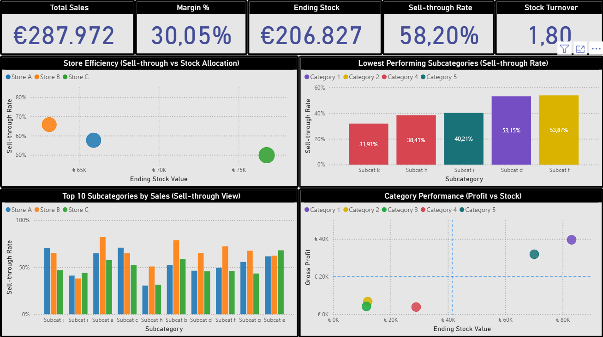
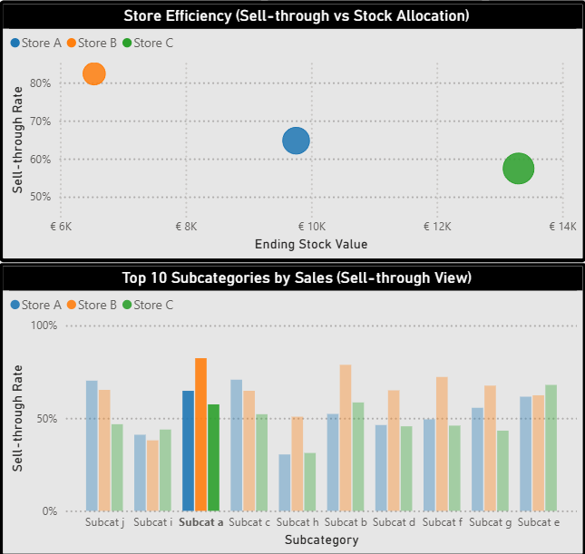
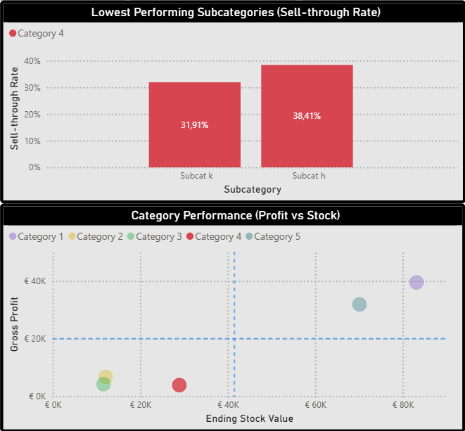

# Store Performance & Inventory Analysis

Power BI case study on store performance, inventory efficiency, and stock allocation decisions.

## Objective

The goal of this project is to evaluate store performance in relation to inventory levels and support better stock allocation decisions across multiple retail locations.

## Key Business Questions

This analysis was built around four core decision areas:

1. Store Performance Efficiency
Which store underperforms relative to the inventory it holds?
→ Focus on stock efficiency, not just total sales

2. Inventory Risk Detection
Are there categories or subcategories where stock accumulates without sufficient sales?
→ Early identification of slow-moving or dead stock

3. Stock Reallocation Opportunities
Are there indications that products or categories would perform better if moved across stores?
→ Example:

- Store A: high stock, low sales
- Store B: low stock, high sales

4. Sales Quality vs Inventory Investment
Which categories generate revenue but tie up disproportionate inventory?
→ Focus on efficiency, not just revenue

## Key Insights

- A clear imbalance in sell-through across stores highlights opportunities for stock redistribution from lower-performing locations to higher-demand stores
- Certain categories show consistently low sell-through despite holding significant inventory, indicating inefficient allocation and potential overstock risk
- Inventory is not optimally aligned with demand patterns across locations

## Business Recommendations

- Reallocate inventory between stores to better match demand patterns and improve overall stock efficiency
- Apply targeted promotional actions (e.g. markdowns, improved in-store visibility) to accelerate slow-moving inventory
- Reassess the long-term role of consistently underperforming categories within the product mix
- Monitor sell-through and stock turnover as core KPIs for ongoing allocation decisions

## Dashboard Overview

The dashboard includes:

- KPI summary (Sales, Stock, Sell-through, Turnover)
- Store-level performance comparison
- Subcategory-level sell-through analysis
- Profit vs Stock efficiency visualization

## Notes

This project uses anonymized data for presentation purposes and is based on real retail operations scenarios.

### Dashboard Overview

*Overview of store performance and inventory efficiency across locations.*

### Store-Level Opportunity (High Sell-through, Low Stock)

*Higher sell-through in one store despite lower stock levels highlights a clear opportunity for stock redistribution.*

### Category Underperformance (Low Sell-through, High Stock)

*Low sell-through combined with relatively high inventory indicates inefficient stock allocation and potential overstock risk.*
